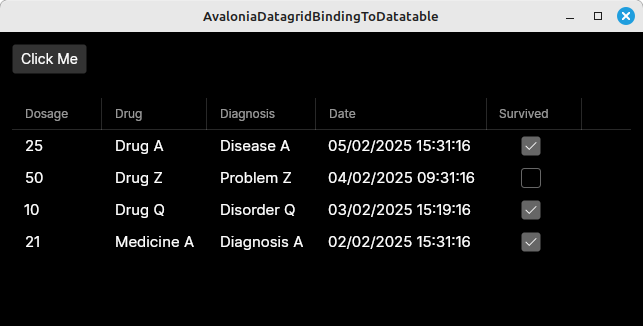

# Avalonia Datagrid Binding To Datatable

How to get an [Avalonia DataGrid](https://docs.avaloniaui.net/docs/reference/controls/datagrid)
to display a [Microsoft DataTable](https://learn.microsoft.com/en-us/dotnet/api/system.data.datatable?view=net-9.0)





## Pre-requisites
*   .NET SDK 9


## Getting started
```bash
# clone repo
git clone https://github.com/TrevorDArcyEvans/AvaloniaDatagridBindingToDatatable.git

# build
cd AvaloniaDatagridBindingToDatatable/
dotnet build

# run app
cd AvaloniaDatagridBindingToDatatable.Desktop/
dotnet run
```

## How it works
The secret sauce which makes it work is in `MainView.axaml.cs`.

The Avalonia `DataGrid` is bound to a Microsoft `DataTable.DefaultView`.  When the Avalonia `DataGrid` is populated,
each Avalonia `DataGridRow` is passed a Microsoft
[DataRowView](https://learn.microsoft.com/en-us/dotnet/api/system.data.datarowview.row?view=net-9.0).

The opaque string in the Avalonia `Binding` constructor:

```csharp
          gridCol.Binding = new Avalonia.Data.Binding($"Row.ItemArray[{x.Ordinal}]");
          // ^                                           ^
          // |                                           |
          // Avalonia DataGridBoundColumn                Microsoft DataRowView.Row
```

refers to which column (`x.Ordinal`) of the data (`Row.ItemArray`) in (Microsoft) `DataRowView.Row` to find the value
for that particular (Avalonia) column (`gridCol`).


## Acknowledgements
* based on the issue:
  * [How do I bind a DataTable to a DataGrid?](https://github.com/AvaloniaUI/Avalonia/discussions/13238)

